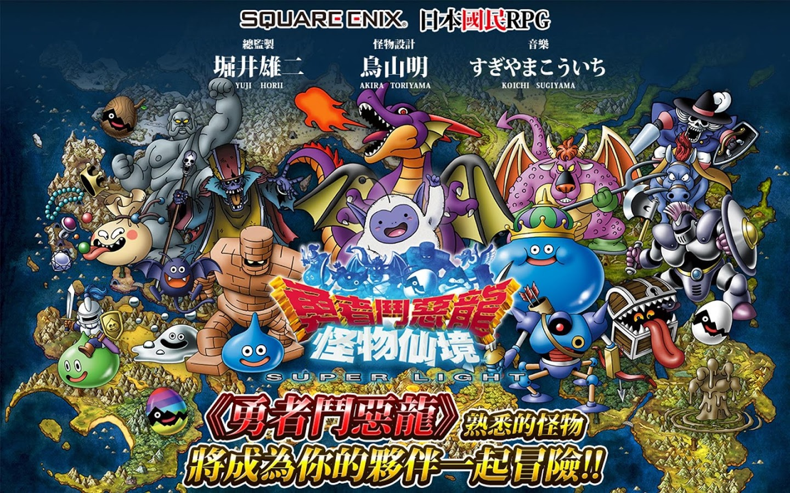
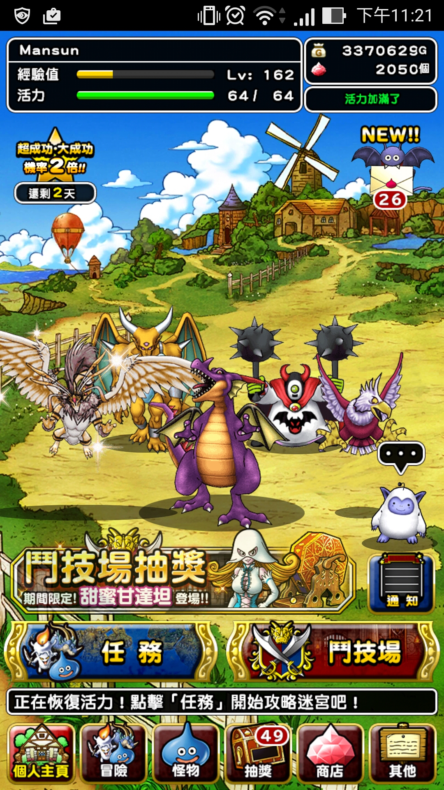
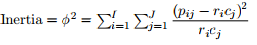
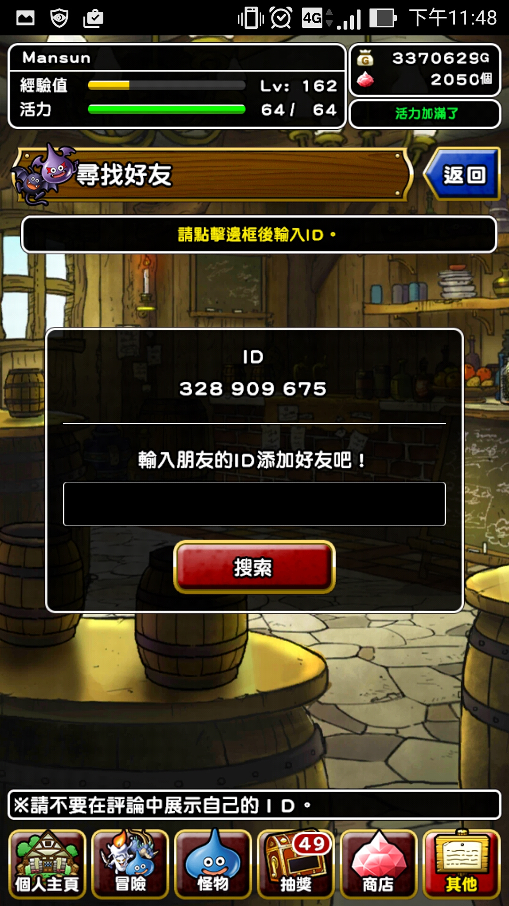

## 首先 {.flexbox .vcenter .emphasized}

恭喜Taiwan R User Group 三歲了


## 據說 {.flexbox .vcenter .emphasized}

今天有殘酷擂台


## 所以在這特別的日子 {.flexbox .vcenter .emphasized}

<span>當然要講一些<span style="text-decoration: line-through">有的沒有的</span>有趣的主題</span>


## DQMSL {.flexbox .vcenter .emphasized}

是什麼？可以吃嗎？


## DQMSL = 勇者鬥惡龍怪物仙境 {.flexbox .vcenter}

<div class="centered">

https://play.google.com/store/apps/details?id=net.gamon.dqmslTW
</div>


## 當初看到這個遊戲 {.flexbox .vcenter .emphasized}

身為骨灰級的玩家眼淚都要掉下來了啊


## 不知荒廢了多少的青春

<div class="centered">

</div>


## 既然叫做怪物仙境 {.flexbox .vcenter .emphasized}

就是有很多怪物的意思


## 為了這次的活動 {.flexbox .vcenter .emphasized}

我就稍微爬了一下怪物的資料


## Load libraries

```{r message=FALSE, warning=FALSE}
library(rvest)
library(stringr)
library(data.table)
library(googleVis)
library(ca)
library(proxy)
```


## Get urls

<div class="code_block">

```{r cache=TRUE}
ranking_pages = read_html("http://dqmsl-search.net/ranking/allsbjstatus?hide=&hides=,star1,star2,star3,star4")
urls_xpath = "/html/body/div[@class='mainh']/div[@class='mainc']/div[@class='ccol']/div[@class='mbox'][2]/div[@class='mboxb']/div/div[@class='innnerHideDiv']/div/div/a"
base_url = "http://dqmsl-search.net"
monster_urls = ranking_pages %>% 
    html_nodes(xpath = urls_xpath) %>%
    html_attr(name = "href") %>%
    unique() %>%
    (function(x) {paste0(base_url, x, sep = "")}) 
monster_urls[1:3]
```

ETL is omitted.

</div>


## Preprocessing

```{r}
monsters = fread("data/monsters.csv")
character_cols = c("id", "name", "rank", "system", "type")
numeric_cols = names(monsters)[!names(monsters) %in% character_cols]
monsters[, c(numeric_cols) := lapply(.SD, as.numeric), .SDcols = numeric_cols]
monsters[, total := hp + mp + str + def + agi + int]
monsters[, icon := sprintf('', 
                           str_pad(id, width = 6, pad = "0"), id, name)]
monsters[, name := sprintf("<a href='http://dqmsl-search.net/monster/detail?no=%s'>%s</a>",
                           id, name)]
monsters[, `:=`(like_percent = like / view * 100, 
                hate_percent = hate / view * 100)]
monsters = monsters[order(total, decreasing = TRUE),]
```


## Monsters' Data

```{r results='asis'}
mtable = gvisTable(monsters, options = list(page = "enable",
                                            pageSize = 5))
print(mtable, "chart")
```


## Plot categorical data with barchart

```{r}
print_bar = function(dt, colname, height = 400, width = 900) {
    percent = dt[, .(percent = .N), by = colname][
        , percent := percent / sum(percent) * 100]
    print(gvisBarChart(percent, options = list(height = height, width = width)), 
          "chart")
}
```


## Rank distribution

```{r results='asis'}
print_bar(monsters, "rank")
```


## System distribution

```{r results='asis'}
print_bar(monsters, "system")
```

## Type distribution

```{r results='asis'}
print_bar(monsters, "type")
```


## System vs Type

```{r}
system_type = table(monsters$system, monsters$type)
system_type
```


## Stacked barchart

```{r results='asis'}
system_type_dt = as.data.table(round(prop.table(system_type, margin = 1) * 100, 2))
setnames(system_type_dt, names(system_type_dt), c("system", "type", "count"))
system_type_dt = dcast(system_type_dt, system ~ type, value.var = "count")
yvar = names(system_type_dt)[!names(system_type_dt) %in% "system"]
print(gvisBarChart(system_type_dt, xvar = "system", yvar = yvar, 
                  options = list(isStacked = TRUE, height = 300, width = 900)), "chart")
```


## Correspondence analysis

```{r}
cafit = ca(system_type)
ca_dt = rbind(data.table(Dim1 = cafit$rowcoord[, 1], 
                         system = cafit$rowcoord[, 2],
                         system.html.tooltip = rownames(system_type), 
                         type = rep(NA, nrow(system_type)),
                         type.html.tooltip = rep(NA, nrow(system_type))),
              data.table(Dim1 = cafit$colcoord[, 1], 
                         system = rep(NA, ncol(system_type)),
                         system.html.tooltip = rep(NA, ncol(system_type)),
                         type = cafit$colcoord[, 2],
                         type.html.tooltip = colnames(system_type)))
tick_str = "{'ticks': [-5, -4, -3, -2, -1, 0, 1, 2] }"
ca_plot = gvisScatterChart(ca_dt, options = list(width = 500, height = 500,
                                                 hAxis = tick_str, vAxis = tick_str))
```


## Correspondence analysis - 2

<div class="code_block">

The total variance of the data matrix is measured by the inertia, which ressembles a chi-square statistic 
but is calculated on relative observed and expected frequencies.



The cummulative percentage of inertia of two dimension is about
`r round(sum(round(cafit$sv^2, 6)[1:2]) / sum(round(cafit$sv^2, 6)) * 100)`
%.

```{r}
cafit
```

</div>

## Correspondence analysis - 3

```{r results='asis'}
print(ca_plot, "chart")
```


## Weight

```{r}
print(ftable(rank ~ weight, data = monsters))
```


```{r results='asis', include=FALSE}
# body_cols = c("hp", "mp", "str", "def", "agi", "int")
# mean_body_cols = paste0("mean_", body_cols)
# scaled_body_cols = paste0("scaled_", body_cols)
# asd = copy(monsters)
# # asd[, c(mean_body_cols) := lapply(.SD, mean), 
# #     by = c("rank", "weight", "system"), 
# #     .SDcols = body_cols]
# asd[, c(scaled_body_cols) := lapply(.SD, function(x){x - mean(x)}), 
#     by = c("rank", "weight", "system"), 
#     .SDcols = body_cols]
```


## Classical Multidimensional scaling

Here we choose SS monsters to find distance of monsters via hp, mp, str, def, agi and int.

```{r results='asis'}
body_cols = c("hp", "mp", "str", "def", "agi", "int")
scaled_body_cols = paste0("scaled_", body_cols)
ss = copy(monsters[rank %in% c("SS"), ])
ss[, icon := str_replace(icon, 'width=\"40\"', 'width=\"120\"')]
ss[, c(scaled_body_cols) := lapply(.SD, scale), .SDcols = body_cols]
ss_dist = dist(ss[, scaled_body_cols, with = FALSE])

fit = cmdscale(ss_dist, eig = TRUE, k=2)
plot_dt = data.table(Dim1 = fit$points[,1],
                     Dim2 = fit$points[,2],
                     Dim2.html.tooltip = ss$icon)

plot_out = gvisScatterChart(plot_dt, options=list(tooltip="{isHtml:'true'}",
                                                  width = 500, height = 500, 
                                                  legend = '{"position": "none"}'))
```

## Classical Multidimensional scaling - 2

GOF measures the goodness of fit of Multidimensional scaling

g.i = (sum{j=1..k} λ[j]) / (sum{j=1..n} T.i(λ[j])), 
where:

- λ[j] are the eigenvalues (sorted in decreasing order)
- T.1(v) = abs(v) 
- T.2(v) = max(v, 0)

```{r}
fit$GOF
```


## Classical Multidimensional scaling - 3

```{r results='asis'}
print(plot_out, "chart")
```


```{r include=FALSE}
# plot_dt = data.table(like_percent = ss$like_percent,
#                      hate_percent = ss$hate_percent,
#                      hate_percent.html.tooltip = ss$icon)
# plot_out = gvisScatterChart(plot_dt, options=list(tooltip="{isHtml:'true'}",
#                                                   width = 500, height = 500, 
#                                                   legend = '{"position": "none"}'))
```


## Compute mean for each type

```{r results='asis'}
ss_type_mean = ss[, lapply(.SD, mean), 
                  by = c("type"), 
                  .SDcols = body_cols]
ss_type_mean = dcast(melt(ss_type_mean, id.vars = "type"), variable ~ type)
plot_out = gvisLineChart(ss_type_mean, xvar = "variable", 
                         options = list(height = 300, width = 800))
print(plot_out, "chart")
```


## Skills of monsters

Skills of monsters can be found in 
[this page](http://dqmsl-search.net/picturebook/skill).

```{r results='asis'}
skills = fread("data/skills.csv")
skills[, skill_mp := str_replace_all(skill, "^.*\\(消費MP:|\\)$", "")]
skills = suppressWarnings(merge(skills, 
               monsters[, .(monster = gsub("<a href=\\'.*\\'>|</a>", "", 
                                           monsters$name), rank, name, system, icon)],
               by = "monster", all.x = TRUE, all.y = FALSE))
stable = gvisTable(skills, options = list(page = "enable",
                                          pageSize = 5))
```


## Skills Table

```{r results='asis'}
print(stable, "chart")
```


## Skills type

```{r results='asis'}
print_bar(skills, "skill_type")
```


## Most common skills

```{r results='asis'}
skill_count = skills[, .(count = .N), by = "skill"][order(-count)]
sctable = gvisTable(skill_count, options = list(page = "enable",
                                               pageSize = 10))
print(sctable, "chart")
```


## Classical Multidimensional scaling via skill


```{r results='asis'}
ss_skills = copy(skills[rank %in% c("SS"),])
monster_skill = table(ss_skills$monster, ss_skills$skill_type)
skills_dist = dist(monster_skill, method = "jaccard")
ss_skills_dist = dist(monster_skill, method = "jaccard")

fit = cmdscale(ss_skills_dist, eig = TRUE, k=2)
plot_dt = data.table(Dim1 = fit$points[,1],
                     Dim2 = fit$points[,2],
                     Dim2.html.tooltip = ss$icon)
plot_out = gvisScatterChart(plot_dt, options=list(tooltip="{isHtml:'true'}",
                                                  width = 500, height = 500, 
                                                  legend = '{"position": "none"}'))
```


## Classical Multidimensional scaling via skill - 2

<div class="code_block">

The GOF is around `r round(max(fit$GOF), 2)`.

```{r}
fit$GOF
```

</div>

## Classical Multidimensional scaling via skill - 3

```{r results='asis'}
print(plot_out, "chart")
```


## Correspondence analysis via skill

```{r}
ss_skills = copy(skills[rank %in% c("SS"),])
monster_skill = table(ss_skills$system, ss_skills$skill_type)
cafit = ca(monster_skill)
ca_dt = rbind(data.table(Dim1 = cafit$rowcoord[, 1], 
                         system = cafit$rowcoord[, 2],
                         system.html.tooltip = rownames(monster_skill), 
                         skilltype = rep(NA, nrow(monster_skill)),
                         skilltype.html.tooltip = rep(NA, nrow(monster_skill))),
              data.table(Dim1 = cafit$colcoord[, 1], 
                         system = rep(NA, ncol(monster_skill)),
                         system.html.tooltip = rep(NA, ncol(monster_skill)),
                         skilltype = cafit$colcoord[, 2],
                         skilltype.html.tooltip = colnames(monster_skill)))
tick_str = "{'ticks': [-5, -4, -3, -2, -1, 0, 1, 2] }"
ca_plot = gvisScatterChart(ca_dt, options = list(width = 500, height = 500,
                                                 hAxis = tick_str, vAxis = tick_str))
```

## Correspondence analysis via skill - 2 

<div class="code_block">

The cummulative percentage of inertia of two dimension is about
`r round(sum(round(cafit$sv^2, 6)[1:2]) / sum(round(cafit$sv^2, 6)) * 100)`
%.

```{r}
cafit
```

</div>


## Correspondence analysis via skill - 3

```{r results='asis'}
print(ca_plot, "chart")
```


## 最後

<div class="columns-2">

在勇者鬥惡龍的世界,與怪物們一起冒險吧!輸入邀請碼「**BLNEeQbw**」即可獲得豪華獎勵！

- [iOS](https://itunes.apple.com/us/app/yong-zhe-dou-e-long-guai-wu/id942902540?l=zh&ls=1&mt=8)
- [Android](https://play.google.com/store/apps/details?id=net.gamon.dqmslTW)

<br><br><br><br><br><br><br><br><br><br><br><br><br><br><br><br><br>



</div>


## {.flexbox .vcenter .emphasized}

謝謝大家(有機會到這一頁嗎XD)


